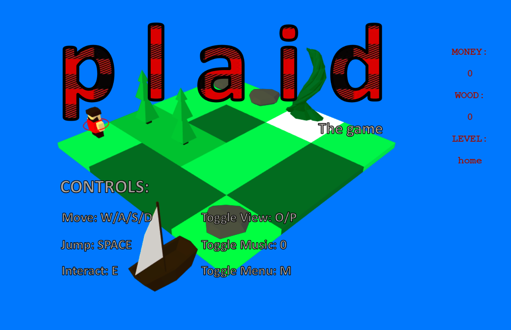

# Plaid

3D Lumberjack Life Simulator Game made for a GameJam competition written using Javascript, CSS and THREE.js.
Authors: Will Foster-Hall, Reuben Bishop 

# To Run

//Python 2.x
python -m SimpleHTTPServer

//Python 3.x
python -m http.server
